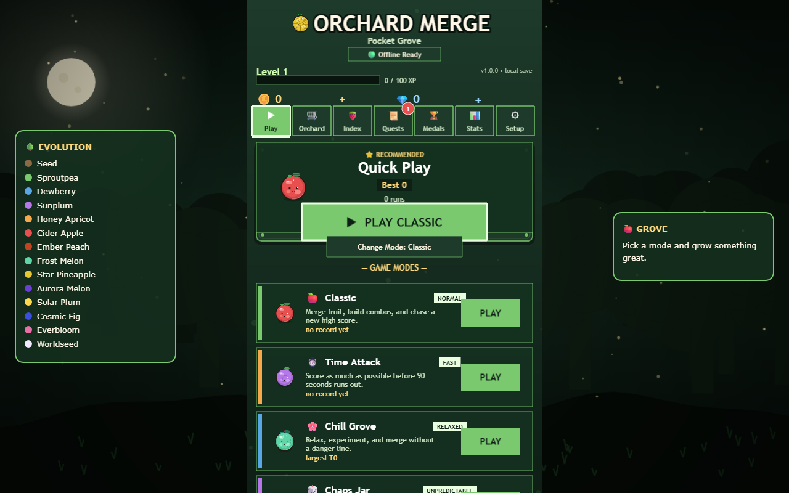
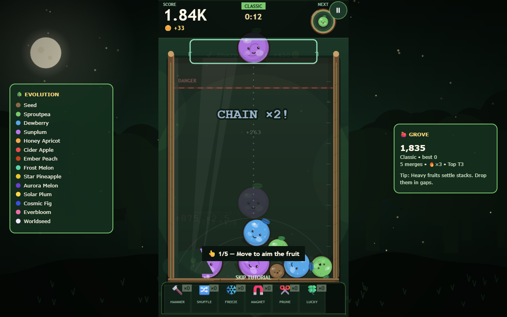

# 🍓 Orchard Merge — Pocket Grove

A cozy, fully **offline** merge-fruit arcade game. Drop fruits into the terrarium jar, merge matching pairs up a 14-tier orchard chain, chain combos for huge scores, and don't cross the DANGER line.

Built with **Phaser 4 + Matter physics + TypeScript + Vite**. No CDN, no fonts, no audio, no API calls, no tracking — everything is procedural and bundled locally, installable as a PWA.




## ✨ Features

- **14-tier merge chain** — Seed → Sproutpea → Dewberry → … → Aurora Melon → Solar Plum → Cosmic Fig → Everbloom → **Worldseed**, plus 8 wild specials (Popfruit, Frostpea, Lodestone Plum, Prismfruit, Golden Apple, Iron Plum, Chrono Berry, Ghost Grape)
- **Chain combos with real punch** — escalating CHAIN ×N announcements, rainbow effects, rising pitch, screen shake, hit-stop, and a 0.75×-per-link score multiplier
- **Score that feels alive** — racing count-up, HUD pop punch, floating `+score ×multiplier` popups, and gold milestone flashes (10K, 100K, 1M…)
- **7 game modes** — Classic, Time Attack, Chill Grove (zen, no danger line), Chaos Jar, Hardcore, seeded Daily Challenge, Lucky Fountain
- **Meta progression** — coins/gems, XP levels, 8 upgrades, shop unlocks, power-ups (hammer, shuffle, freeze, magnet, prune, lucky), boosts, achievements, milestones, daily tasks, 7-day streaks
- **Juice everywhere** — squash & stretch, blinking/breathing fruits, orbiting sparks on mythics, leaf bursts, coin sparkles, combo timer ring, landing ghost + drop guide
- **Sound** — 15 hand-picked bundled SFX (WebAudio, tier-pitched) plus a 3-track looping acoustic main theme; master/music/SFX sliders, mute, ambience toggle
- **Saves that survive** — IndexedDB (idb-keyval) with lz-string compression and zod-validated schema + automatic repair; works fully offline as an installable PWA

## 🚀 Quick start

Requires **Node 18+**.

```bash
npm install
npm run dev        # play at http://localhost:5173
```

```bash
npm run build      # typecheck + production bundle → dist/
npm run preview    # serve the offline PWA (default :4173)
```

## 🧪 Tests

```bash
npm test            # vitest unit + property tests (save, economy, merging)
npm run test:e2e    # Playwright offline smoke test (boots, plays, merges, zero network)
npm run offline:check  # verify no remote requests leak into the bundle
npm run synth:audio    # regenerate procedural audio assets
```

## 🗂 Project structure

```
src/
├── scenes/       # Boot, Preload, Menu, Game, Pause, GameOver
├── config/       # fruit tiers, physics tuning, economy, graphics
├── data/         # modes, shop items, missions/achievements
├── effects/      # procedural fruit art, juice/particles, backdrop
├── audio/        # WebAudio synth + bundled SFX manager
├── game/ input/ physics/ entities/   # gameplay systems
├── economy/ progression/ persistence/ # coins, XP, saves (IndexedDB)
├── store/        # zustand meta-store (single source of truth)
├── ui/           # theme, tooltips, side panels
├── dev/          # DEV-only debug panel (tweakpane) + perf overlay
└── utils/        # RNG, number formatting, net-guard
tests/            # unit/property tests + Playwright e2e
docs/images/      # screenshots used above
```

Key files: `src/scenes/GameScene.ts` (core loop), `src/config/fruitConfig.ts` (tiers/specials), `src/persistence/SaveSchema.ts` (save v1 + repair), `src/audio/AudioManager.ts` (synth + samples).

## 🎮 Controls

| Input | Action |
|---|---|
| Mouse / touch drag | Aim |
| Click / tap / `Space` | Drop fruit |
| `←` `→` | Nudge aim |
| `1`–`6` | Use power-up |
| `P` / `Esc` | Pause |
| `M` | Master mute |

## 📦 Offline & privacy

- All art is generated at runtime (canvas textures); all music/SFX are bundled or synthesized — **zero network requests during play**, verified by `npm run offline:check` and the e2e suite.
- The service worker precaches the full bundle (~10 MB incl. music) for installable offline play.
- Saves never leave the device. No accounts, no analytics.

See [DEPENDENCIES.md](DEPENDENCIES.md) for the full dependency audit (licenses + offline status).
