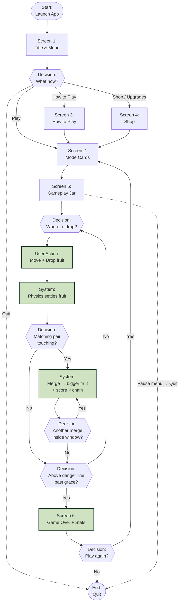

# Orchard Merge — User Flow

Drawn before implementation (late June), updated as screens were added.
Same visual language as the reference example: circles = start/end,
rectangles = screens, diamonds = decisions, shaded boxes = user actions,
dashed lines = quit/exit paths.

## User Flow Key

| Shape | Meaning |
|---|---|
| 🟢 Circle (Start / End) | Entry and exit points |
| ⬜ Rectangle (Screen) | A screen the player sees |
| 🔷 Diamond (Decision) | A choice — player or system |
| 🟩 Shaded box (User Action / System) | Something that happens |
| ➖➖ Dashed line | Quit / exit path |

## Reading the flow

- The **core loop** is `aim → drop → settle → match? → merge → chain?` — the
  addictive middle the whole game is built around.
- **Every exit returns to a screen, never a dead end**: pause quits to menu,
  game over offers one-more-run or menu.
- **No-loss onboarding**: the first run shows a 5-step tutorial overlay before
  the danger line matters, so step 1–2 (aim, drop) are learned risk-free.
- **Economy loop (off the critical path)**: coins/gems earned in runs are
  spent in the Shop screen, which feeds back into runs via unlocks and
  power-ups — a second, slower loop around the core one.
